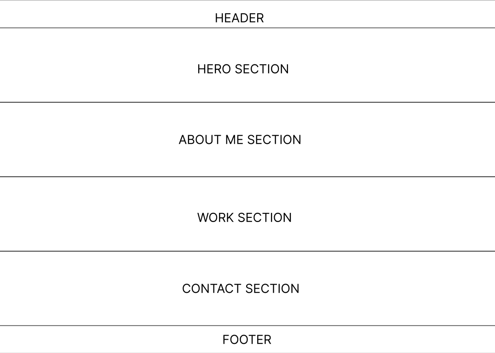

# Design

## Project's Design Overview

The design of the portfolio website is aimed at providing a clean, modern, and
interactive user experience. A key addition to the design is the scroll-based
animations to create a more dynamic and engaging experience for users.

### Design Reasoning

- **Minimalistic Approach**: The design follows a minimalist structure to keep
  the focus on the content.
- **Responsive Layout**: The website’s layout adjusts for different screen
  sizes. All animations are designed to run smoothly across devices.
- **Typography**: "Lora" is used for body text, and "Playfair Display" is
  applied to headings for consistency across the design.
- **Color Palette**: The color scheme is neutral, with a base of whites and
  grays, and accent colors such as blue or green are used for buttons,
  highlights, and call-to-action elements.
- **User Experience (UX)**: The website is designed to be user-friendly, with
  easy-to-find sections like the portfolio, about me, and contact details.

---

## Wireframe(s)

<!-- provide a link to your wireframe documenting on Figma, or wherever it is -->
